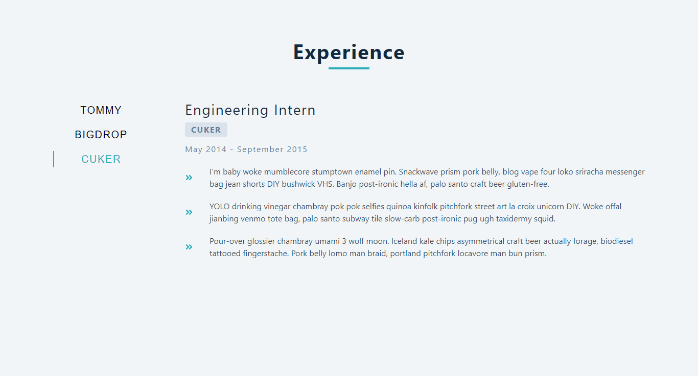

#### Homepage

[view](https://femi-ologunwa.github.io/6-tabs/)

;

### Implementation

-  Fetching data items from an api
-  Illustrated conditional rendering
-  Destructuring and displaying data fetched from api 
-  Used dynamically generated buttons to change state values which in turn determines what will be displayed
-  Illustrated the use of template strings for class names
